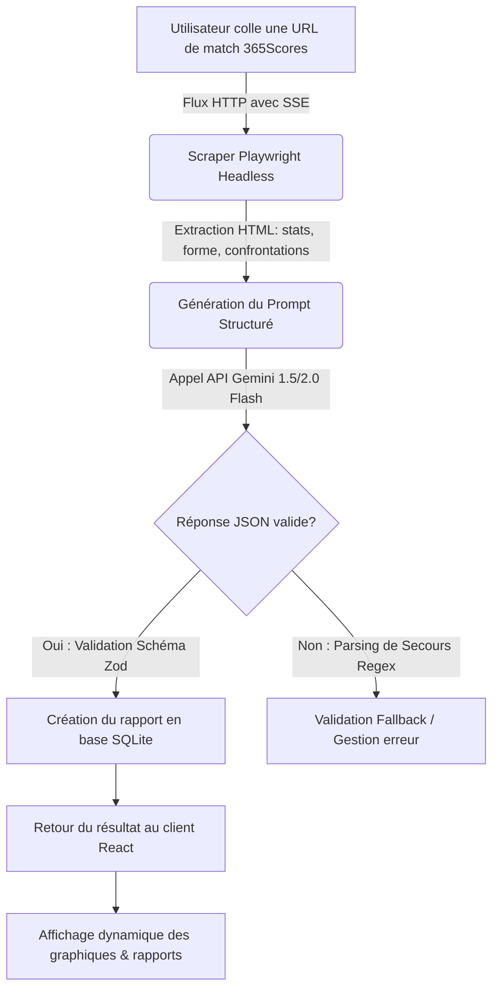

<p align="center">
  
</p>

<h1 align="center">
  ⚽ Football Prono AI
</h1>

<p align="center">
  Plateforme full-stack de prédiction footballistique combinant <b>scraping en temps réel</b> (Playwright), <b>intelligence artificielle</b> (Google Gemini) et un tableau de bord moderne pour analyser les matchs et générer des pronostics statistiques d'expert.
</p>

<p align="center">
  <a href="#-capabilities"></a>
  <a href="#-workflow"></a>
  <a href="#-base-de-données"></a>
  <a href="#-structure-du-projet"></a>
  <a href="#-getting-started"></a>
</p>

<p align="center">
  
  
  
  
  
  
</p>

---

### 🧠 La Philosophie: Pourquoi Football Prono AI ?

Les amateurs de football et parieurs perdent souvent des heures à recouper les statistiques de forme, les historiques de confrontations (H2H) et les cotes pour tenter de décrypter l'issue d'un match. Les sites de statistiques sont surchargés d'informations brutes, difficiles à synthétiser rationnellement.

**Football Prono AI** transforme cette analyse en automatisant l'extraction de données et en confiant la modélisation à un moteur d'IA générative configuré comme un analyste sportif d'élite. 
À partir d'un simple lien [365Scores](https://www.365scores.com), l'application extrait l'intégralité du contexte d'un match, évalue le rapport de force, calcule les probabilités et rédige une synthèse claire et argumentée sous forme de rapport d'analyse.

---

## 📈 Capabilities

- 📊 **Tableau de Bord Holistique** : Suivez votre historique de prédictions sur un dashboard ergonomique, avec consultation directe des rapports d'analyses passés et gestion des suppressions.
- 🕷️ **Scraping Automatisé** : Extraction temps réel de la forme des équipes, du classement, des cotes, des buteurs et des confrontations directes via Playwright Headless.
- 🔮 **Prédictions Multi-Marchés** :
  - **1X2 & Double Chance** avec pourcentages de probabilité.
  - **Over/Under 2.5 Buts** & Les deux équipes marquent (BTTS).
  - **Top 3 des scores exacts** calculés statistiquement.
  - **Estimation corners & cartons** par mi-temps.
- ⚡ **Streaming en Temps Réel** : Visualisation de l'avancement de la tâche (extraction, structuration, analyse Gemini) grâce aux Server-Sent Events (SSE).
- 🛡️ **Authentification Sécurisée** : Gestion de compte et connexion sécurisée par jeton JWT stocké localement.
- 🌐 **Résolution de Logos Wikipedia** : Importation et cache asynchrone des logos des équipes de football directement depuis Wikipedia pour enrichir le visuel des matchs.

---

## ⚙️ Workflow



---

## 🗄️ Base de Données

Le backend s'appuie sur une base de données relationnelle légère SQLite pour la gestion des données de session et de l'historique :

| Table Name | Description | Key Fields |
| :--- | :--- | :--- |
| **`users`** | Données d'authentification et comptes utilisateurs | `id` (PK AUTOINCREMENT), `email` (UNIQUE), `password_hash`, `created_at` |
| **`predictions`** | Rapports d'analyse IA et métadonnées de match | `id` (PK AUTOINCREMENT), `user_id` (FK users.id), `match_url`, `equipe_domicile`, `equipe_exterieur`, `prediction_json` (TEXT JSON), `created_at` |

---

## 📂 Structure du Projet

```text
football-prono-ai/
├── .GCC/                                # Logs de suivi Git-Context-Controller
├── render.yaml                          # Configuration d'infrastructure Cloud Render
├── football_prono_backend/              # --- API BACKEND EXPRESS ---
│   ├── index.js                         # Point d'entrée de l'application
│   ├── app.js                           # Configuration Express et middlewares
│   ├── package.json                     # Dépendances & scripts du serveur
│   ├── config/
│   │   └── database.js                  # Initialisation SQLite & helpers de requêtes
│   ├── controllers/
│   │   ├── authController.js            # Inscriptions, connexions JWT et profils
│   │   └── predController.js            # Lancement des analyses et gestion d'historique
│   ├── models/
│   │   ├── userModel.js                 # Requêtes SQL d'authentification utilisateur
│   │   └── predModel.js                 # Requêtes SQL de gestion des analyses
│   ├── services/
│   │   ├── aiService.js                 # Client API Gemini et parsing Zod
│   │   └── scraperService.js            # Scraper Playwright Headless 365Scores
│   └── tests/                           # Suite de tests (Jest & Supertest)
└── football_prono_frontend_react/       # --- FRONTEND REACT ---
    ├── index.html                       # Base HTML principale
    ├── vite.config.js                   # Configuration du bundler Vite
    ├── package.json                     # Dépendances et scripts de build
    ├── public/
    │   └── _redirects                   # Redirections de routes SPA Netlify
    └── src/
        ├── main.jsx                     # Bootstrap de React
        ├── App.jsx                      # Routage applicatif client
        ├── index.css                    # Design System & thèmes CSS
        ├── components/
        │   ├── TeamLogo.jsx             # Résolveur et afficheur de logos Wikipedia
        │   └── Loader.jsx               # Indicateur de chargement d'analyse
        ├── context/
        │   └── AuthContext.jsx          # Fournisseur de session d'authentification
        ├── pages/
        │   ├── Landing.jsx              # Page d'accueil de présentation
        │   ├── Auth.jsx                 # Page d'accès (Se connecter / S'inscrire)
        │   ├── Dashboard.jsx            # Tableau de bord principal
        │   └── Report.jsx               # Rapport détaillé d'analyse IA
        └── services/
            └── api.js                   # Client HTTP API centralisé
```

---

## 🚀 Getting Started

Suivez ces instructions pour lancer le projet dans votre environnement de développement local.

### Prérequis
* **Node.js** (v18.0.0 ou supérieur)
* **npm** (v9.0.0 ou supérieur)

### Installation Locale

1. **Cloner le dépôt :**
   ```bash
   git clone https://github.com/leandre755/football-prono-ai.git
   cd football-prono-ai
   ```

2. **Configurer et démarrer le Backend :**
   ```bash
   cd football_prono_backend
   npm install
   ```
   Créez un fichier `.env` dans le dossier `football_prono_backend/` :
   ```env
   PORT=3000
   NODE_ENV=development
   GEMINI_API_KEY=votre_cle_api_gemini
   JWT_SECRET=votre_cle_secrete_jwt
   ```
   *Note : Vous pouvez obtenir une clé d'API Gemini gratuite sur [Google AI Studio](https://aistudio.google.com/apikey).*

   Démarrez le serveur de développement :
   ```bash
   npm run dev
   ```

3. **Configurer et démarrer le Frontend :**
   ```bash
   cd ../football_prono_frontend_react
   npm install
   npm run dev
   ```
   L'application est maintenant disponible sur `http://localhost:5173`.

---

## 🌐 Déploiement en Production

### Backend & SQLite (sur Render)
Le fichier `render.yaml` à la racine configure automatiquement un **Web Service** Node.js avec un **disque persistant** (volume de 1 Go) monté sur `/opt/render/project/src/data` pour conserver la base SQLite `database.sqlite` entre les déploiements.
*   Poussez votre projet sur GitHub.
*   Connectez votre dépôt sur le dashboard Render en tant que **Blueprint**.
*   Saisissez votre clé `GEMINI_API_KEY` dans l'invite.

### Frontend React (sur Netlify)
Le frontend est configuré pour un déploiement statique ultra-rapide sur Netlify :
*   **Base directory** : `football_prono_frontend_react`
*   **Build command** : `npm run build`
*   **Publish directory** : `dist`
*   **Environment Variable** : Créez la variable `VITE_API_URL` avec l'URL publique de votre backend Render.
*   *Le fichier `_redirects` gère automatiquement la redirection vers `index.html` pour éviter les erreurs 404 lors du rafraîchissement des routes privées.*

---

## 👤 Auteur d'origine

**Silué Doh Lassinan (Dohlas)**
- [Profil GitHub](https://github.com/Dohlas)